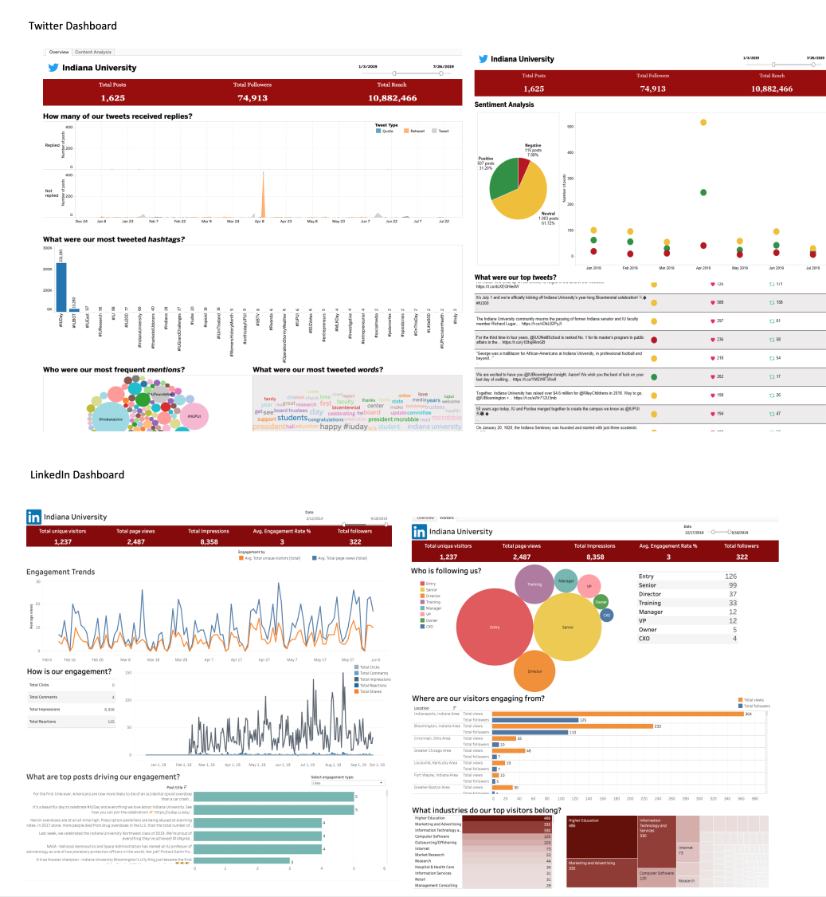
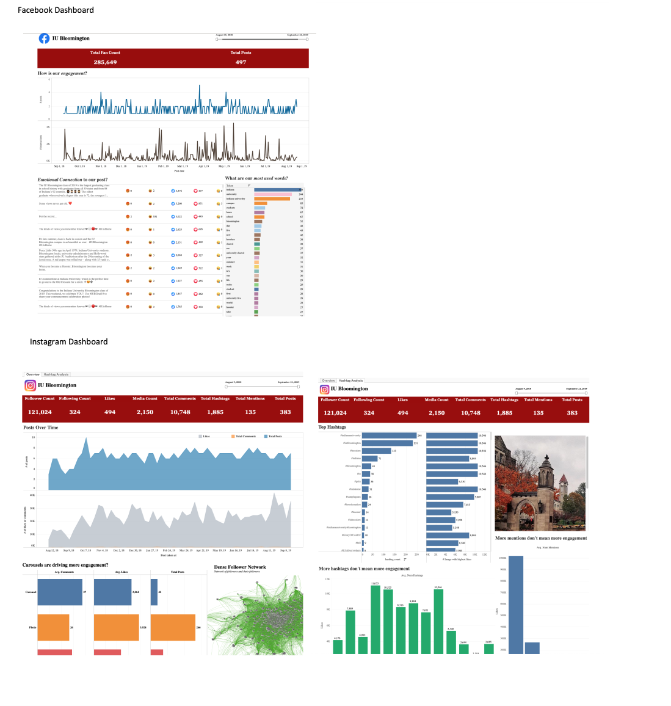

# Social Media Analytics 

Following are the list of social channels explored to retrieve IU data:

1. Twitter
2. Instagram
3. Facebook
4. LinkedIn

The data was saved and used to build tableau dashboards deployed on IU site.

The goal of social media dashboards is to provide insight into social media traffic for IU such that a successful socialmedia strategy can be setup to maximize brand awareness and brand positioning for IU

## Snapshots of Tableau dashboards:

